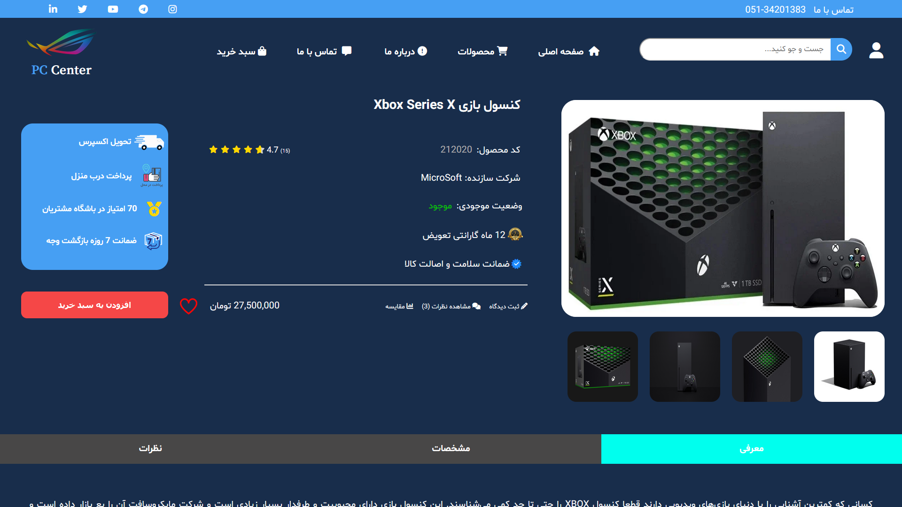

# PC-Center-Shop

<h2> About this project </h2>
Hi. this project is a web store that I am creating for learning the web front-end developing and it is a gaming webshop and It is my first webShop
and I'm using HTML and CSS and Vanila javaScript to create this webpage and I'm not using any CSS and javaScript framework and this webpage is not responsive.
every image and name and product that I'm using in this website is random and there is no comercial or business putpose to It and this is a learning/training project.
You can use the project if yo acknowledge the terms of use in <a src="/License.md"> License </a>.
Mohammad Sadra Kiantash

<h2> Website Images </h2>

